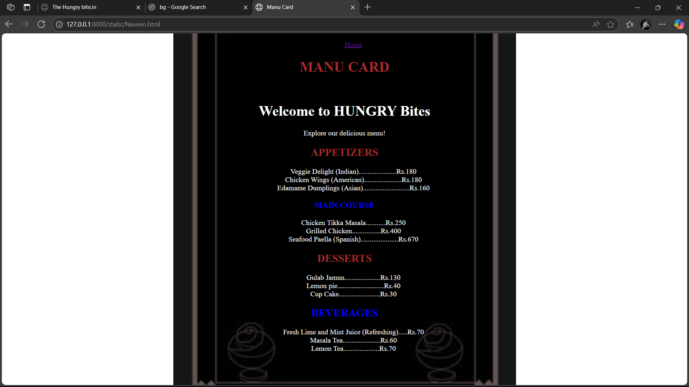
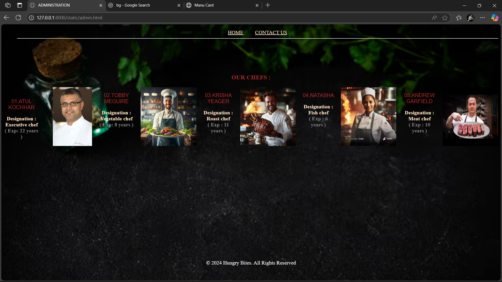
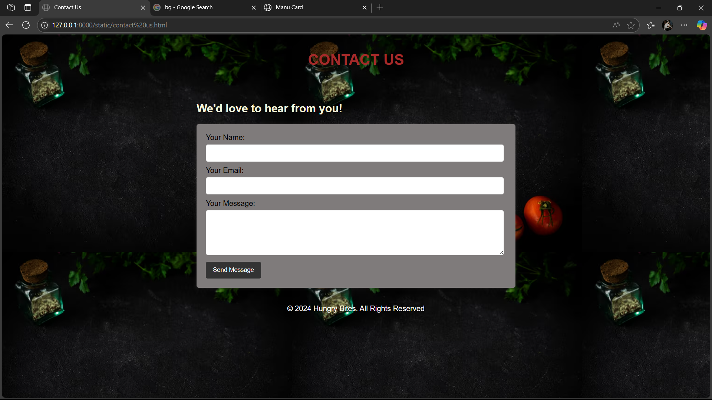

# Ex.07 Restaurant Website
# Date:21-11-2024
# AIM:
To develop a static Restaurant website to display the food items and services provided by them.

# DESIGN STEPS:
## Step 1:
Requirement collection.

## Step 2:
Creating the layout using HTML and CSS.

## Step 3:
Updating the sample content.

## Step 4:
Choose the appropriate style and color scheme.

## Step 5:
Validate the layout in various browsers.

## Step 6:
Validate the HTML code.

## Step 7:
Publish the website in the given URL.

# PROGRAM:
```
<!DOCTYPE html>
<html>
    <head>
        <title>The Hungry bite.in</title>
        <style>
             body{
                background-size: 1550px;
                background-image: url(https://img.freepik.com/premium-photo/high-angle-view-tomatoes-cilantro-by-herb-bottle-black-table_1048944-22848081.jpg);
                background-repeat: no-repeat;

            }.image-row {
                    display: flex;
                    gap: 1.3%;
                }
                .image-row img{
                    width: 170PX;
                    height: 180PX;

                }
                footer {
                    
                     color: white;
                     padding: 2px;
                     text-align: center;
                }
        </style>
            </head>
            <center>
                <body>
                    <h1 style="color: antiquewhite;">THE HUNGRY Bites</h1>
                    <h2 style="color: gray;">Welcome to HUNGRY Bites!</h2>
                    <h3 style="color: blanchedalmond;">( 30% Discount for Sea Foods )</h3>
                    <nav>
                        <ul>
                            <hr><a href="https://www.zomato.com/chennai/order-food-online" style="color: bisque; size: 10px;" >ORDER</a>------
                            <a href="C:\Users\navee_2o7x4uh\OneDrive\Desktop\HTML\Naveen.html" style="color: bisque;">MENU</a>------
                            <a href="C:\Users\navee_2o7x4uh\OneDrive\Desktop\HTML\Restuarent\admin.html" style="color: bisque;">ABOUT</a>------
                            <a href="file:///C:/Users/navee_2o7x4uh/OneDrive/Desktop/HTML/Restuarent/contact%20us.html" style="color: bisque;">CONTACT US</a><hr>
                            
                        </ul>
                    </nav>
                    <h3 style="color: bisque;">The Perfect Bite, Every Time</h3>
        <style>
            
        </style>
        <br>
        <br>
        <br>
        <br>
        <div  class="image-row">
            <div>
                <br><br><p><B style="color: antiquewhite;">01.CHICKEN TIKKA</B></p>
                <p style="color: bisque;">(Chicken Tikka are boneless pieces of chicken)</p>
                <p  style="color: beige;">Price : Rs.250</p>
            </div>
            <BR>
                
                <div>
                    <br><br><p><b style="color: antiquewhite;">02.GRILLED CHICKEN</b></p>
                    <p style="color: bisque;">(This recipe guarantees juicy, flavorful chicken every time.)</p>
                    <p  style="color: beige;">Price : Rs.400</p>
                </div>
                
                <div>
                    <br><br><p style="color: rgb(236, 227, 236);"><b>03.SEAFOOD PEALLA</b></p>
                    <p style="color: bisque;">(clams, mussels and shrimp along with smoky chorizo and saffron)</p>
                    <p  style="color: beige;">Price : Rs.670 (30%) </p>
                </div>
                
                <div>
                    <br><br><p style="color: rgb(238, 200, 200);">04.CHICKEN WINGS</p>
                    <p style="color: bisque;">(super crispy Baked Chicken Wings!)</p>
                    <p  style="color: beige;">Price : Rs.180</p>
                </div>
                
                
            </div>
            <br>
            <br>
            <h4 style="color: bisque;">THANK YOU, Visit Again...</h4>
            <br>
        </center><br><br><br>
        <footer>
            <p>&copy; 2024 Hungry Bites. All Rights Reserved</p>
        </footer>
    </body>
</html>
```
```
<!DOCTYPE html>
<html>
    <head>
        <title>ADMINISTRATION</title>
        <style>
             body{
                background-size: 1550px;
                background-image: url(https://img.freepik.com/premium-photo/high-angle-view-tomatoes-cilantro-by-herb-bottle-black-table_1048944-22848081.jpg);
                background-repeat: no-repeat;

            }.image-row {
                    display: flex;
                    gap: 1.4%;
                }
                .image-row img{
                    width: 170PX;
                    height: 180PX;

                }
                footer {
                    
                     color: white;
                     padding: 2px;
                     text-align: center;
                }
        </style>
            </head>
            <center>
                <body>
                    <nav>
                        <ul>
                            <a href="C:\Users\navee_2o7x4uh\OneDrive\Desktop\HTML\Restuarent\hotal.html" style="color: bisque; size: 10px;" >HOME</a>------
                            <a href="file:///C:/Users/navee_2o7x4uh/OneDrive/Desktop/HTML/Restuarent/contact%20us.html" style="color: bisque;">CONTACT US</a><hr>
                            
                        </ul>
                    </nav>
                   <br><br><br><br>
                    <h3 style="color: brown;"> OUR CHEFS :</h3>
        <style>
            
        </style>
        
        <div  class="image-row">
            <div>
                <br><p style="color: brown; font-family: Arial, Helvetica, sans-serif;" >01.ATUL KOCHHAR</p>
                <b  style="color: bisque;">Designation : Executive chef</b><br>
                <b style="color: gray;"> ( Exp: 22 years )</b>
            </div>
            <BR>
                
                <div>
                    <p style="color: brown; font-family: Arial, Helvetica, sans-serif;">02.TOBBY MEGUIRE</p>
                    <b  style="color: bisque;">Designation : Vegetable chef</b><br>
                    <b style="color: gray;"> ( Exp: 8 years )</b>
                </div>
                

                <div>
                    <p style="color: brown; font-family: Arial, Helvetica, sans-serif;">03.KRISHA YEAGER</p>
                    <b  style="color: bisque;">Designation : Roast chef</b><br>
                    <b style="color:gray;"> ( Exp : 11 years )</b>
                </div>
                

                <div>
                    <p style="color: brown; font-family: Arial, Helvetica, sans-serif;">04.NATASHA</p>
                    <b  style="color: bisque;">Designation : Fish chef</b><br>
                    <b style="color: gray;"> ( Exp : 6 years )</b>
                </div>
                

                <div>
                    <p style="color: brown; font-family: Arial, Helvetica, sans-serif;">05.ANDREW GARFIELD</p>
                    <b  style="color: bisque;">Designation : Meat chef</b><br>
                    <b style="color: gray;"> ( Exp : 10 years )</b>
                </div>
                
               
            </div>
            <br>
            <br>
            <br>
        </center><br><br><br><br><br><br><br><br><br><br><br><br><br><br><br>
        <footer>
            <p>&copy; 2024 Hungry Bites. All Rights Reserved</p>
        </footer>
    </body>
</html>

```

```
<!DOCTYPE html>
<html>
<head>
    <title> Contact Us </title>
    <style>
        body {
            font-family: Arial, sans-serif;
            margin: 0;
            padding: 0;
            background-image: url(https://img.freepik.com/premium-photo/high-angle-view-tomatoes-cilantro-by-herb-bottle-black-table_1048944-22848081.jpg);
            
        }
        header {
            background-image:url(https://img.freepik.com/premium-photo/high-angle-view-tomatoes-cilantro-by-herb-bottle-black-table_1048944-22848081.jpg);
            color: white;
            padding: 15px 0;
            text-align: center;
        }
        .container {
            width: 45%;
            margin: 0 auto;
            padding: 18px;
        }
        form {
            background-color: #7f7b7b;
            padding: 20px;
            border-radius: 5px;
            box-shadow: 0 0 8px rgba(192, 183, 183, 0.1);
        }
        label {
            display: block;
            margin-bottom: 5px;
        }
        input, textarea {
            width: 96%;
            padding: 10px;
            margin-bottom: 10px;
            border-radius: 5px;
            border: 1px solid #ccc;
        }
        button {
            background-color: #333;
            color: white;
            padding: 10px 15px;
            border: none;
            border-radius: 4px;
            cursor: pointer;
        }
        button:hover {
            background-color: brown;
        }
        footer {
                     
                     color: white;
                     padding: 2px;
                     text-align: center;
        }
    </style>
</head>
<body>

<header>
    <h1 style="color: brown;">CONTACT US</h1>
</header>

<div class="container">
    <h2 style="color: beige;">We'd love to hear from you!</h2>
    <form action="#" method="POST">
        <label for="name">Your Name:</label>
        <input type="text" id="name" name="name" required>

        <label for="email">Your Email:</label>
        <input type="email" id="email" name="email" required>

        <label for="message">Your Message:</label>
        <textarea id="message" name="message" rows="5" required></textarea>

        <button type="submit">Send Message</button>
    </form>
</div>
<footer>
    <p>&copy; 2024 Hungry Bites. All Rights Reserved</p>
</footer>
</body>
</html>

```
```
<!DOCTYPE html>
<html>
    <center>
<head>
    <title>Manu Card</title>
    <header>
    <div class="container">
        <nav>
            <ul>
                <a href="hotal.html">Home</a>
            </ul>
        </nav>

</div>
</header>
   
</head>
<body background="https://png.pngtree.com/thumb_back/fh260/back_our/20190628/ourmid/pngtree-vector-western-meal-afternoon-tea-menu-background-image_265487.jpg" style="background-repeat: no-repeat; background-position: center; background-size: 50%;">

<header>
    <h1 style="color: brown;">MANU CARD</h1><br>
<h1 ><font color="white">Welcome to HUNGRY Bites</h1>
        <p>Explore our delicious menu!</p>
    </header>
    


    <main>
        <section id="Appetizers">
            <h2 style="color: brown;">APPETIZERS</h2>
            <ul>
                <li>Veggie Delight (Indian).....................Rs.180</li>
                <li>Chicken Wings (American).....................Rs.180 </li>
                <li>Edamame Dumplings (Asian)..........................Rs.160</li>
            </ul>
        </section>

        <section id="MAIN COURSE">
            <h3 style="color: blue;">MAIN COURSE</h3>
            <ul>
                <li> Chicken Tikka Masala...........Rs.250</li>
                <li> Grilled Chicken................Rs.400 </li>
                <li>Seafood Paella (Spanish).....................Rs.670</li>
            </ul>
        </section>

        <section id="DESSERTS">
            <h2 style="color: brown;">DESSERTS</h2>
            <ul>
                <li>Gulab Jamun....................Rs.130</li>
                <li>Lemon pie..........................Rs.40</li>
                <li>Cup Cake.......................Rs.30</li>
            </ul>
        </section>

        <section id="Beverages">
            <h2 style="color: blue;">BEVERAGES</h2>
            <ul>
                <li>Fresh Lime and Mint Juice (Refreshing).....Rs.70</li>
                <li>Masala Tea.....................Rs.60</li>
                <li>Lemon Tea....................Rs.70</li>
            </ul>
        </section>
    </main>
</center>
</body>
</html>

</div>

```
# OUTPUT:


.png>)
# Manu card:

# About us:

# Contact us :

# RESULT:
The program for designing website for restuarent using HTML and CSS is completed successfully.
